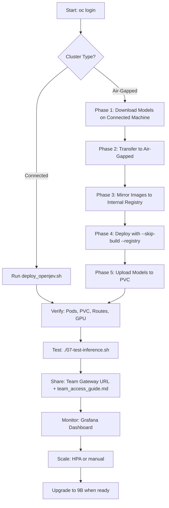

# Open-Jev 2B OpenShift Deployment

Complete deployment package for running Open-Jev 2B inference on OpenShift with NVIDIA GPU support, including **team gateway exposure** for secure multi-team access.

---

## Architecture Overview

```
┌─────────────────────────────────────────────────────────────────────────────┐
│                        OpenShift Cluster                                     │
│  ┌─────────────────────────────────────────────────────────────────────┐    │
│  │ Namespace: jev-model                                                 │    │
│  │                                                                      │    │
│  │  ┌─────────────────┐    ┌─────────────────┐    ┌────────────────┐  │    │
│  │  │ Deployment      │    │ PVC             │    │ Service        │  │    │
│  │  │ open-jev        │    │ jev-model-pvc   │    │ open-jev       │  │    │
│  │  │ 1 replica       │    │ 50Gi (RWO)      │    │ ClusterIP:8791 │  │    │
│  │  │ 1 GPU (NVIDIA)  │◄───│ /models/        │◄───│                │  │    │
│  │  │ HPA: 1-3 pods   │    │ Qwen + OpenJev  │    │                │  │    │
│  │  └────────┬────────┘    └─────────────────┘    └───────┬────────┘  │    │
│  │           │                                            │           │    │
│  │  ┌────────▼────────────────────────────────────────────▼──────┐   │    │
│  │  │                  GATEWAY EXPOSURE LAYER                    │   │    │
│  │  │  ┌─────────────────────────────────────────────────────┐  │   │    │
│  │  │  │ Route: open-jev-gateway                             │  │   │    │
│  │  │  │   Host: open-jev-team.apps.<CLUSTER_DOMAIN>         │  │   │    │
│  │  │  │   TLS: Edge termination, HTTPS redirect             │  │   │    │
│  │  │  │   Rate Limit: 100 req/s per client                  │  │   │    │
│  │  │  │   Timeout: 120s for inference                       │  │   │    │
│  │  │  └─────────────────────────────────────────────────────┘  │   │    │
│  │  │  ┌─────────────────────────────────────────────────────┐  │   │    │
│  │  │  │ NetworkPolicy: open-jev-team-access                 │  │   │    │
│  │  │  │   Allow: monitoring, team namespaces (label-based)  │  │   │    │
│  │  │  │   Deny:  all other namespaces by default            │  │   │    │
│  │  │  └─────────────────────────────────────────────────────┘  │   │    │
│  │  │  ┌─────────────────────────────────────────────────────┐  │   │    │
│  │  │  │ HPA: open-jev-hpa                                   │  │   │    │
│  │  │  │   Metrics: CPU 70%, Memory 80%                      │  │   │    │
│  │  │  │   Scale: 1→3 replicas, GPU-aware                    │  │   │    │
│  │  │  └─────────────────────────────────────────────────────┘  │   │    │
│  │  │  ┌─────────────────────────────────────────────────────┐  │   │    │
│  │  │  │ Monitoring: ServiceMonitor + Grafana Dashboard      │  │   │    │
│  │  │  │   Metrics: latency, RPS, GPU util, memory, errors   │  │   │    │
│  │  │  └─────────────────────────────────────────────────────┘  │   │    │
│  │  └────────────────────────────────────────────────────────────┘   │    │
│  └─────────────────────────────────────────────────────────────────────┘    │
└─────────────────────────────────────────────────────────────────────────────┘
```

---

## Prerequisites

| Requirement | Details |
|-------------|---------|
| **OpenShift** | 4.12+ with cluster-admin or project-admin |
| **NVIDIA GPU Operator** | Installed and `Succeeded` (check `oc get csv -A \| grep gpu`) |
| **GPU Nodes** | At least 1 node with `nvidia.com/gpu.present=true` label |
| **Storage** | ~50GB available for PVC (adjust per storage class) |
| **CLI Tools** | `oc`, `jq`, `git`, `curl` |
| **Network** | VPN/access to `api.f80l034.fusion.tadn.ibm.com:6443` |

### Verify Prerequisites

```bash
# Check cluster access
oc whoami
oc version

# Check GPU Operator
oc get csv -A -l operators.coreos.com/gpu-operator.openshift-operators

# Check GPU nodes
oc get nodes -l nvidia.com/gpu.present=true \
  -o custom-columns=NAME:.metadata.name,GPU:.status.capacity.nvidia\.com/gpu,PRODUCT:.metadata.labels.nvidia\.com/gpu\.product

# Check storage classes
oc get storageclass
```

---

## Quick Start: Connected Cluster

### 1. Clone Repository

```bash
git clone https://github.com/k-nishant09/Jevmodeldeployment.git
cd Jevmodeldeployment
```

### 2. Make Scripts Executable

```bash
chmod +x deploy_openjev.sh 07-test-inference.sh 06-model-loading/*.sh
```

### 3. Login to OpenShift

```bash
oc login --token=sha256~BMB3kgB_CY9R4UM2n5poIsADjCAly7dk6GlVHoDhFbA \
         --server=https://api.f80l034.fusion.tadn.ibm.com:6443
```

### 4. Run Full Deployment

```bash
./deploy_openjev.sh \
  --namespace jev-model \
  --storage-class thin-csi \
  --storage-size 50Gi
```

**What this does:**
1. ✅ Verifies GPU Operator and GPU nodes
2. ✅ Creates namespace `jev-model` with labels
3. ✅ Applies RBAC/SCC for GPU workloads (`restricted-v2` SCC)
4. ✅ Creates 50Gi PVC with specified storage class
5. ✅ Builds Open-Jev image via OpenShift BuildConfig (clones from GitHub)
6. ✅ Deploys Deployment + Service + Route + **Gateway** (08-gateway-api.yaml)
7. ✅ Downloads and loads models to PVC (Qwen3.5-2B + Open-Jev-2B)
8. ✅ Validates with inference test
9. ✅ Outputs **Team Gateway URL**

---

## Quick Start: Air-Gapped / Disconnected Cluster

### Phase 1: On Connected Machine (Download & Package)

```bash
# 1. Download models from Hugging Face
./06-model-loading/load_models.sh --stage=download

# 2. Package into tarballs for transfer
./06-model-loading/load_models.sh --stage=package

# Output: ./staging/qwen-model.tar.gz, ./staging/open-jev-model.tar.gz, ./staging/MANIFEST.txt
```

### Phase 2: Transfer to Air-Gapped Environment

```bash
# Transfer the entire ./staging/ directory via secure method
# (USB, internal file share, scp through bastion, etc.)
```

### Phase 3: On Air-Gapped Machine (Mirror Images)

```bash
# Mirror required container images to internal registry
./06-model-loading/mirror_to_internal_registry.sh registry.internal.company.com/ai

# This creates:
# - ImageContentSourcePolicy (ICSP) for cluster-wide mirror
# - ImageStream pointing to internal registry
# - Instructions for pull secret creation
```

### Phase 4: Deploy on Air-Gapped Cluster

```bash
# Apply ICSP (requires cluster-admin, triggers node reboot)
oc apply -f /tmp/icsp-open-jev.yaml

# Apply ImageStream
oc apply -f /tmp/imagestream-internal.yaml -n jev-model

# Create pull secret for internal registry
oc create secret docker-registry internal-registry-pull-secret \
  --docker-server=registry.internal.company.com \
  --docker-username=<USER> --docker-password=<PASS> \
  --docker-email=<EMAIL> -n jev-model

oc secrets link builder internal-registry-pull-secret --for=pull -n jev-model
oc secrets link default internal-registry-pull-secret --for=pull -n jev-model

# Deploy (skip build since image is mirrored)
./deploy_openjev.sh \
  --namespace jev-model \
  --registry registry.internal.company.com/ai \
  --skip-build \
  --storage-class <YOUR_STORAGE_CLASS> \
  --storage-size 50Gi
```

### Phase 5: Load Models to PVC (Air-Gapped)

```bash
# Upload staged models to PVC
./06-model-loading/load_models.sh --stage=upload --namespace jev-model
```

---

## Deployment Script Options

```bash
./deploy_openjev.sh [OPTIONS]

Options:
  --namespace NAMESPACE      OpenShift namespace (default: jev-model)
  --storage-class CLASS      PVC storage class (default: thin-csi)
  --storage-size SIZE        PVC size (default: 50Gi)
  --registry REGISTRY        Internal registry for air-gapped (optional)
  --skip-build               Skip image build (use existing image)
  --skip-model-load          Skip model loading (models already on PVC)
  --dry-run                  Show what would be deployed without applying
  --help                     Show this help
```

### Examples

```bash
# Standard deployment
./deploy_openjev.sh --namespace jev-model --storage-class thin-csi --storage-size 50Gi

# With custom storage class (ODF/Ceph)
./deploy_openjev.sh --storage-class ocs-storagecluster-ceph-rbd --storage-size 100Gi

# Air-gapped with internal registry
./deploy_openjev.sh --registry registry.internal.company.com/ai --skip-build

# Dry run to preview
./deploy_openjev.sh --dry-run

# Skip model loading (models pre-loaded)
./deploy_openjev.sh --skip-model-load
```

---

## Post-Deployment Verification

### 1. Check All Resources

```bash
# Pods
oc get pods -n jev-model -l app=open-jev -o wide

# PVC
oc get pvc -n jev-model

# Services & Routes
oc get svc,route -n jev-model

# HPA
oc get hpa -n jev-model

# NetworkPolicy
oc get networkpolicy -n jev-model

# ServiceMonitor
oc get servicemonitor -n jev-model
```

### 2. Verify Model Loading (Check Logs)

```bash
# Follow deployment logs
oc logs -f -n jev-model deployment/open-jev

# Look for:
# - "Loading Qwen model from /models/Qwen3.5-2B"
# - "Loading Open-Jev adapter from /models/Open-Jev-2B/package/checkpoint"
# - "Model loaded successfully"
# - "Server listening on 0.0.0.0:8791"
```

### 3. Test Inference (Internal)

```bash
# Run automated test suite
./07-test-inference.sh --namespace jev-model
```

### 4. Test Inference (Team Gateway / External)

```bash
# Test via external HTTPS route
./07-test-inference.sh --namespace jev-model --route
```

### 4. Verify GPU Utilization

```bash
# Check GPU status in pod
oc exec -n jev-model $(oc get pod -n jev-model -l app=open-jev -o name) -- nvidia-smi

# Expected output:
# +-----------------------------------------------------------------------------+
# | NVIDIA-SMI 535.xx       Driver Version: 535.xx       CUDA Version: 12.x     |
# |-------------------------------+----------------------+----------------------+
# | GPU  Name        Persistence-M| Bus-Id        Disp.A | Volatile Uncorr. ECC |
# | Fan  Temp  Perf  Pwr:Usage/Cap|         Memory-Usage | GPU-Util  Compute M. |
# |===============================+======================+======================|
# |   0  NVIDIA A100           On | 00000000:00:1E.0 Off |                    0 |
# | N/A   35C    P0    35W / 300W |   14500MiB / 40960MiB |     15%      Default |
# +-----------------------------------------------------------------------------+
```

### 5. Get Team Gateway URL

```bash
oc get route open-jev-gateway -n jev-model -o jsonpath='{.spec.host}'
# Output: open-jev-team.apps.<YOUR_CLUSTER_DOMAIN>
```

---

## Team Access Configuration

### Gateway Endpoints

| Endpoint | URL | Use Case |
|----------|-----|----------|
| **Team Gateway (HTTPS)** | `https://open-jev-team.apps.<DOMAIN>` | Production team access |
| **Internal Service** | `http://open-jev.jev-model.svc.cluster.local:8791` | Internal services, sidecars |
| **Developer Console** | OpenShift Console → Application Menu → AI/ML Services | Discovery |

### Authentication Methods

#### Option 1: Service Account Token (Applications)

```bash
# Create SA in team namespace
oc create sa my-app -n team-alpha

# Get token (24h expiry)
TOKEN=$(oc create token my-app -n team-alpha --duration=24h)

# Use in requests
curl -X POST https://open-jev-team.apps.<DOMAIN>/predict \
  -H "Authorization: Bearer $TOKEN" \
  -H "Content-Type: application/json" \
  -d '{"state": "...", "questions": {...}}'
```

#### Option 2: User Token (Interactive)

```bash
TOKEN=$(oc whoami -t)
curl -X POST https://open-jev-team.apps.<DOMAIN>/predict \
  -H "Authorization: Bearer $TOKEN" \
  -H "Content-Type: application/json" \
  -d '{"state": "...", "questions": {...}}'
```

#### Option 3: Enable Team Namespace Access

```bash
# Label team namespace for NetworkPolicy access
oc label namespace team-alpha team-access=enabled team=alpha

# Now pods in team-alpha can access open-jev.jev-model.svc.cluster.local:8791
```

---

## API Reference

### Health Check

```bash
curl https://open-jev-team.apps.<DOMAIN>/health
# Response: {"status": "healthy", "model": "open-jev-2b", "gpu": "NVIDIA A100"}
```

### Inference Request

**POST** `/predict` or `/infer`

```bash
curl -X POST https://open-jev-team.apps.<DOMAIN>/predict \
  -H "Authorization: Bearer $TOKEN" \
  -H "Content-Type: application/json" \
  -d '{
    "state": "The customer order arrived damaged and the customer is requesting a full refund.",
    "questions": {
      "route": {
        "type": "choice",
        "instructions": "Which team should handle this customer issue?",
        "criteria": {
          "billing": "Refunds, charges, and payment issues",
          "support": "General customer inquiries and complaints",
          "engineering": "Software defects and technical bugs",
          "shipping": "Delivery and logistics problems"
        }
      }
    }
  }'
```

### Response Format

```json
{
  "predictions": {
    "route": {
      "probabilities": {
        "billing": 0.92,
        "support": 0.05,
        "engineering": 0.02,
        "shipping": 0.01
      },
      "predicted_label": "billing",
      "confidence": 0.92
    }
  },
  "metadata": {
    "model": "open-jev-2b",
    "latency_ms": 145,
    "tokens_processed": 87
  }
}
```

### Multiple Questions (Single Request)

```json
{
  "state": "Customer reports login failure after password reset.",
  "questions": {
    "severity": {
      "type": "choice",
      "instructions": "Classify severity",
      "criteria": {
        "critical": "System down, data loss, security breach",
        "high": "Major feature broken, many users affected",
        "medium": "Minor feature issue, workaround exists",
        "low": "Cosmetic, enhancement request"
      }
    },
    "team": {
      "type": "choice",
      "instructions": "Route to team",
      "criteria": {
        "identity": "Authentication, authorization, SSO",
        "platform": "Core platform, infrastructure",
        "support": "General customer support"
      }
    }
  }
}
```

---

## Client Libraries

### Python

```python
import requests
import os

class OpenJevClient:
    def __init__(self, base_url: str, token: str = None):
        self.base_url = base_url.rstrip('/')
        self.session = requests.Session()
        if token:
            self.session.headers.update({"Authorization": f"Bearer {token}"})
        self.session.headers.update({"Content-Type": "application/json"})

    def health(self) -> dict:
        return self.session.get(f"{self.base_url}/health", timeout=10).json()

    def predict(self, state: str, questions: dict) -> dict:
        payload = {"state": state, "questions": questions}
        resp = self.session.post(f"{self.base_url}/predict", json=payload, timeout=120)
        resp.raise_for_status()
        return resp.json()

# Usage
client = OpenJevClient(
    base_url="https://open-jev-team.apps.<CLUSTER_DOMAIN>",
    token=os.environ.get("OC_TOKEN")
)

result = client.predict(
    state="Customer wants refund for damaged item",
    questions={
        "route": {
            "type": "choice",
            "instructions": "Route to team",
            "criteria": {
                "billing": "Refunds and charges",
                "support": "General inquiries"
            }
        }
    }
)
print(f"Decision: {result['predictions']['route']['predicted_label']}")
print(f"Confidence: {result['predictions']['route']['confidence']:.2%}")
```

### TypeScript/JavaScript

```typescript
interface OpenJevRequest {
  state: string;
  questions: Record<string, {
    type: "choice";
    instructions: string;
    criteria: Record<string, string>;
  }>;
}

interface OpenJevResponse {
  predictions: Record<string, {
    probabilities: Record<string, number>;
    predicted_label: string;
    confidence: number;
  }>;
  metadata?: { model: string; latency_ms: number };
}

class OpenJevClient {
  constructor(private baseUrl: string, private token?: string) {}

  private headers(): HeadersInit {
    const h: HeadersInit = { "Content-Type": "application/json" };
    if (this.token) h["Authorization"] = `Bearer ${this.token}`;
    return h;
  }

  async predict(request: OpenJevRequest): Promise<OpenJevResponse> {
    const res = await fetch(`${this.baseUrl}/predict`, {
      method: "POST",
      headers: this.headers(),
      body: JSON.stringify(request),
    });
    if (!res.ok) throw new Error(`HTTP ${res.status}: ${await res.text()}`);
    return res.json();
  }
}

// Usage
const client = new OpenJevClient(
  "https://open-jev-team.apps.<CLUSTER_DOMAIN>",
  import.meta.env.VITE_OC_TOKEN
);

const result = await client.predict({
  state: "Server returning 500 errors on checkout",
  questions: {
    severity: {
      type: "choice",
      instructions: "Classify",
      criteria: { critical: "Data loss/downtime", high: "Major feature broken" }
    }
  }
});
console.log(result.predictions.severity.predicted_label);
```

---

## Rate Limits & Quotas

| Tier | Requests/Minute | Burst | Use Case |
|------|-----------------|-------|----------|
| **Default (Team)** | 60 | 10 | Standard team usage |
| **High-Volume** | 300 | 50 | Request via admin |

Exceeding limits returns `429 Too Many Requests` with `Retry-After` header.

---

## Monitoring & Observability

### Grafana Dashboard

**Search**: "Open-Jev 2B Inference Dashboard"

**Panels**:
- CPU Utilization (% per pod)
- Memory Usage (bytes)
- Request Latency (p50, p95 in ms)
- Requests Per Second (RPS)

### Key Metrics

| Metric | Query | Alert Threshold |
|--------|-------|-----------------|
| CPU Utilization | `container_cpu_usage_seconds_total` | > 80% |
| Memory Usage | `container_memory_working_set_bytes` | > 30Gi |
| p95 Latency | `http_request_duration_seconds_bucket` | > 5s |
| Error Rate | `http_requests_total{status=~"5.."}` | > 5% |
| GPU Memory | `nvidia_gpu_memory_used_bytes` | > 35Gi |
| GPU Utilization | `nvidia_gpu_utilization` | > 90% sustained |

### Prometheus ServiceMonitor

Already deployed via `08-gateway-api.yaml`. Scrapes `/metrics` every 30s.

---

## Scaling

### Horizontal Pod Autoscaler (HPA)

```bash
# Check HPA status
oc get hpa -n jev-model

# Manually scale
oc scale deployment open-jev --replicas=2 -n jev-model

# HPA config (in 08-gateway-api.yaml):
# minReplicas: 1, maxReplicas: 3
# CPU target: 70%, Memory target: 80%
```

### GPU Considerations

- Each replica requires **1 full GPU** (`nvidia.com/gpu: "1"`)
- Scale limited by available GPU nodes
- Use node affinity to prefer specific GPU types (A100, H100, etc.)

---

## Upgrading to Open-Jev 9B

After validating 2B:

```bash
# 1. Increase PVC size
oc patch pvc jev-model-pvc -n jev-model -p '{"spec":{"resources":{"requests":{"storage":"100Gi"}}}}'

# 2. Update deployment checkpoint path
oc set env deployment/open-jev -n jev-model \
  OPEN_JEV_CHECKPOINT=/models/Open-Jev-9B/package/checkpoint

# 3. Update Qwen base model on PVC (download 9B version)
# 4. Increase GPU memory: 2x A100 80GB or H100
# 5. Update resource limits: memory 48-64Gi
# 6. Rollout
oc rollout restart deployment/open-jev -n jev-model
```

**Pinned 9B Revisions** (from upstream):
- Qwen Base: `Qwen/Qwen3.5-9B` @ specific revision
- Open-Jev 9B: `ZefanCai/Open-Jev-9B` @ specific revision

---

## Troubleshooting

### Pod Stuck in Pending

```bash
oc describe pod -n jev-model -l app=open-jev

# Common causes:
# - No GPU nodes available (check: oc get nodes -l nvidia.com/gpu.present=true)
# - PVC not bound (check storage class, provisioner)
# - SCC not bound (run: oc adm policy add-scc-to-user restricted-v2 -z open-jev-sa -n jev-model)
# - Image pull error (check ImageStream, pull secret)
```

### Model Not Found / Checkpoint Errors

```bash
# Verify PVC contents
oc run verify -n jev-model --image=registry.access.redhat.com/ubi9/python-311 \
  --rm -it -- ls -la /models/

# Expected structure:
# /models/Qwen3.5-2B/config.json
# /models/Open-Jev-2B/package/checkpoint/adapter_model.safetensors
```

### OOM / CUDA Out of Memory

```bash
# Increase memory limits
oc patch deployment open-jev -n jev-model -p '{
  "spec": {
    "template": {
      "spec": {
        "containers": [{
          "name": "open-jev",
          "resources": {
            "limits": {"memory": "48Gi"},
            "requests": {"memory": "24Gi"}
          }
        }]
      }
    }
  }'
}

# Or reduce batch_size/max_length in deployment args
```

### Health Endpoint 404

```bash
# Check available CLI options
oc exec -n jev-model <pod> -- python -m jev.server --help

# Look for: --host, --port, --health-path, --host
# Update deployment args accordingly
```

### Gateway Returns 503 / 504

```bash
# Check pod readiness
oc get pods -n jev-model -l app=open-jev

# Check logs for model loading status
oc logs -n jev-model deployment/open-jev --tail=100

# Increase startup probe timeout if model loading is slow
oc patch deployment open-jev -n jev-model -p '{
  "spec": {
    "template": {
      "spec": {
        "containers": [{
          "name": "open-jev",
          "startupProbe": {
            "failureThreshold": 60,
            "periodSeconds": 10
          }
        }]
      }
    }
  }'
}
```

### NetworkPolicy Blocking Access

```bash
# Check NetworkPolicy
oc get networkpolicy -n jev-model -o yaml

# Verify team namespace has label
oc get namespace team-alpha --show-labels
# Should show: team-access=enabled

# Add label if missing
oc label namespace team-alpha team-access=enabled --overwrite
```

---

## File Reference

| File | Description |
|------|-------------|
| `Dockerfile` | Multi-stage build (builder → runtime), non-root UID 10001 |
| `01-pvc.yaml` | 50Gi PVC, configurable storage class |
| `02-imagestream-buildconfig.yaml` | OpenShift BuildConfig (Git + Binary) |
| `03-deployment.yaml` | GPU Deployment with probes, affinity, resources |
| `04-service-route.yaml` | ClusterIP Service + HTTPS Route |
| `05-rbac-scc.yaml` | ServiceAccount, RBAC, SCC for GPU |
| `06-model-loading/load_models.sh` | Download → package → upload models |
| `06-model-loading/mirror_to_internal_registry.sh` | Mirror images + ICSP for air-gapped |
| `07-test-inference.sh` | Health + inference validation (internal + gateway) |
| `08-gateway-api.yaml` | **Gateway**: Route, NetworkPolicy, HPA, ServiceMonitor, Grafana dashboard, ConsoleLink |
| `deploy_openjev.sh` | **Master deployment script** |
| `team_access_guide.md` | Team onboarding documentation |

---

## Security

- ✅ Non-root user (UID 10001)
- ✅ Read-only root filesystem (except cache)
- ✅ Dropped ALL capabilities
- ✅ SCC `restricted-v2` (OpenShift 4.11+)
- ✅ NetworkPolicy (default-deny, label-based allow)
- ✅ TLS edge termination on Route
- ✅ Rate limiting on ingress
- ✅ Offline mode (HF_HUB_OFFLINE=1, TRANSFORMERS_OFFLINE=1)

---

## License

- **Open-Jev**: Apache 2.0 (see upstream: https://github.com/Zefan-Cai/Open-Jev)
- **This Deployment**: MIT

---

## Support & References

- **Upstream Open-Jev**: https://github.com/Zefan-Cai/Open-Jev
- **Open-Jev Documentation**: https://zefan-cai.github.io/open-jev/
- **Model Cards**: 
  - Qwen3.5-2B: https://huggingface.co/Qwen/Qwen3.5-2B
  - Open-Jev-2B: https://huggingface.co/ZefanCai/Open-Jev-2B
- **OpenShift GPU Operator**: https://docs.openshift.com/container-platform/latest/specialized_hardware/nvidia-gpu/managing-gpu-nodes.html
- **Team Access Guide**: `team_access_guide.md`

---

## Deployment Flow Summary

